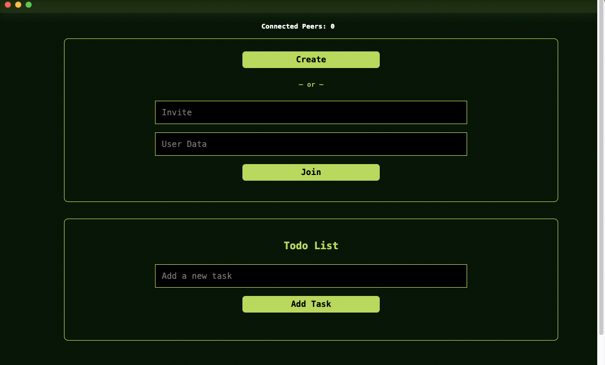

# ToDo-P2P-Pear-App

A ToDo Application with Blind-Pairing, HyperSwarm, Autobase and Hyperbee written in JavaScript over Holepunch with `pear` runtime.


## Run Application
1. Install required packages
```bash
sudo npm install
```

2. Run application in developer environment
```bash
pear run --dev .
```

#### Note: A directory or link needs to be specified with pear run, here `.` denotes the current Project directory.

After the app runs successfully, you should see an output like below:


## Demo Videos

### Demo Without Console
- [Demo Video](https://youtu.be/xF-d9oacR0Q)

### Demo Without Console
- [Demo Video with console](https://youtu.be/ME6jIPFaZ2A)
